*Tabla de contenido* {#tabla-de-contenido .TtulodeTDC}
====================

[*[Información previa]{.underline}* 2](#información-previa)

[*[Configuración de cuentas contables]{.underline}*
2](#configuración-de-cuentas-contables)

[*[Configuraciones módulo CBR]{.underline}*
3](#configuraciones-módulo-cbr)

[*[Configuración facturas por mandato]{.underline}*
3](#configuración-facturas-por-mandato)

[*[Configuración facturas tipo de venta Leasing]{.underline}*
5](#configuración-facturas-tipo-de-venta-leasing)

[*[Consulta de código interno del documento]{.underline}*
6](#consulta-de-código-interno-del-documento)

[*[Proceso de Sincronización]{.underline}*
8](#proceso-de-sincronización)

[*[Validaciones en el proceso de sincronización]{.underline}*
12](#validaciones-en-el-proceso-de-sincronización)

[*[Errores en el proceso de sincronización]{.underline}*
16](#errores-en-el-proceso-de-sincronización)

[*[Consulta de documentos]{.underline}* 23](#consulta-de-documentos)

[*[Generación de archivo plano]{.underline}*
28](#generación-de-archivo-plano)

[*[Re sincronizar documentos]{.underline}*
32](#re-sincronizar-documentos)

[*[Traslado de documentos a proveedor tecnológico]{.underline}*
34](#traslado-de-documentos-a-proveedor-tecnológico)

[*[Errores en el traslado de la información]{.underline}*
37](#errores-en-el-traslado-de-la-información)

[*[Consulta de representación grafica]{.underline}*
38](#consulta-de-representación-grafica)

[*[Consulta de archivo XML]{.underline}* 39](#consulta-de-archivo-xml)

[*[Recomendaciones]{.underline}* 40](#recomendaciones)

[*[Preguntas frecuentes]{.underline}* 41](#preguntas-frecuentes)

*Información previa*
====================

*Configuración de cuentas contables*
------------------------------------

El proceso Facturación Electrónica se basa en copiar y homologar la
información contable de Facturas y Notas crédito. Para que se traslade
la información correctamente al proveedor tecnológico, se debe realizar
una configuración contable con el fin de que el sistema identifique como
debe homologar los valores.

Cada vez que ejecute la [[sincronización de los
documentos]{.underline}](#proceso-de-sincronización), el sistema
validará las cuentas contables que fueron usadas en estos y las agregará
al maestro que podrá encontrar en la ruta *FRO \> Facturación \>
FACTURACIÓN ELECTRÓNICA \> Configuraciones* ficha ***Cuentas
contables**.*

El sistema realiza una primera validación basándose en la distribución
de las cuentas según el PUC, asignando uno de los tipos a continuación,
con el que se realizará la homologación.

-   *NO APLICA*

-   *AMORTIZACIÓN\_ANTICIPO*

-   *DESCUENTO*

-   *RETEGARANTIA*

-   *IVA*

-   *COMISIÓN*

-   *DEVOLUCIÓN*

-   *INGRESO*

-   *RFUENTE*

-   *RICA*

-   *RIVA*

-   *TOTPAGAR*

En caso de no identificar como realiza la contabilización de las
cuentas, el sistema le solicitará al usuario realizar la configuración
manualmente. Al ingresar al maestro el sistema marcará las cuentas que
no tengan un tipo asignado para que pueda configurarlo.

{width="5.269530839895013in"
height="0.7395833333333334in"}

*Configuraciones módulo CBR*
----------------------------

### *Configuración facturas por mandato*

Debe contar con una clase de proyecto con la marca Fiducia asignada.
Ingrese a la opción *CBR \> Configuración \> CARTERA \> Configuración
Clases Proyecto.*

{width="5.88125in"
height="1.2580336832895889in"}

Registre una nueva clase de proyecto o elija una de las que ya tiene
creadas en la opción y asigne la marca en la columna Fiducia.

{width="5.903230533683289in"
height="1.26875in"}

El proyecto debe estar configurado con la clase de proyecto mencionada
anteriormente.

1.  Consulte el proyecto desde la ruta *CBR \> Configuración \>
    PROYECTO \> Proyectos*.

2.  Ingrese a la ficha ***Información Ventas*** y en la sección
    ***Ventas y Porcentajes*** agregue la clase de proyecto que
    configuró en el punto anterior.

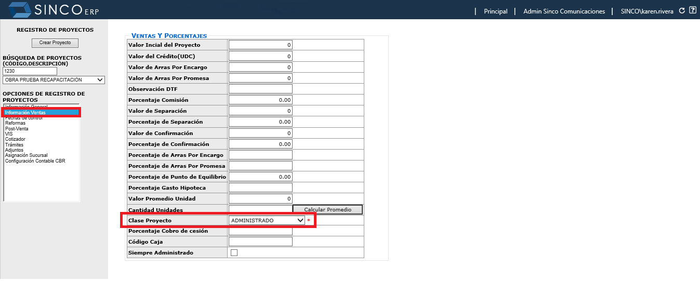{width="5.572291119860018in"
height="2.2375in"}

Los datos del mandante se toman directamente de la configuración del
proyecto.

1.  Diríjase a la ruta *CBR \> Configuración \> PROYECTO \> Proyectos* y
    > consulte el proyecto que desea configurar.

2.  Ingrese a la ficha ***Información Ventas*** y revise que tercero se
    > encuentra asociado en el campo ***Entidad Financiera***.

{width="6.164178696412948in"
height="1.9235837707786527in"}

Ahora diríjase a la opción *CBR \> Configuración \> CARTERA \> Entidades
Financieras* y consulte el tercero.

{width="6.191666666666666in"
height="2.1356386701662293in"}

Valide que este tenga asociado el NIT con el que se encuentra registrado
el tercero en el módulo FRO.

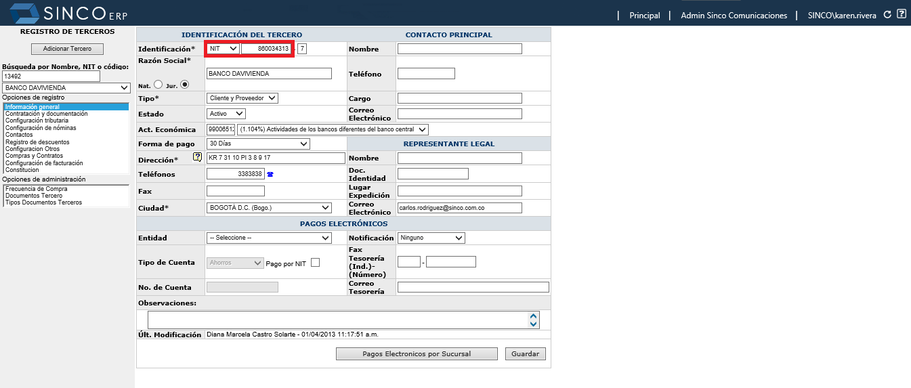{width="6.191896325459318in"
height="2.6268657042869643in"}

Por ultimo debe llenar los campos ***Número de contrato*** y ***Fecha de
contrato,*** en el registro de proyectos ficha *Información general*.
*Este dato es obligatorio para el envío de los datos de mandato.\**

{width="3.44375in" height="0.59375in"}

***NOTA:** En caso de no contar con estos campos, comuníquese con su
director de implementación.*

### *Configuración facturas tipo de venta Leasing*

El sistema cuenta con una regla, cuando el tipo de venta de la
agrupación es Leasing, se toma como adquiriente de la factura a la
entidad de crédito configurada en la venta, el sistema consulta el
nombre del tercero en la página de entidades financieras y el Nit
configurado en esta página lo busca en el registro de terceros para
copiar los datos.

En caso de no desear que la información se tome de esta manera, indique
a su director de implementación del proyecto o a la consultora encarga,
que esta configuración no aplica y que requiere que se tome como
adquiriente al comprador principal, copiando los datos del mismo
directamente desde el módulo FRO.

*Consulta de código interno del documento*
------------------------------------------

En la opción ***Consulta de documentos detallados*** de la ruta *FRO \>
Contabilidad \> Documentos contables \> Informes \> Consulta de
documentos detallados*, podrá realizar la búsqueda del documento. Con
clic derecho podrá habilitar las propiedades de la página para consultar
el código.

Si su explorador es Chrome, deberá seleccionar la opción ***Ver fuente
de marco*.**

{width="3.7313429571303587in"
height="3.5514490376202974in"}

Al seleccionar la opción se habilitará una nueva pestaña la cual
contiene dentro de su dirección el ID del documento (doc=ID).

***Ejemplo:*** El ID de la factura 638 es 93587.

{width="5.8625in"
height="0.8822265966754156in"}

Si su explorador es Explorer, deberá seleccionar la opción propiedades.

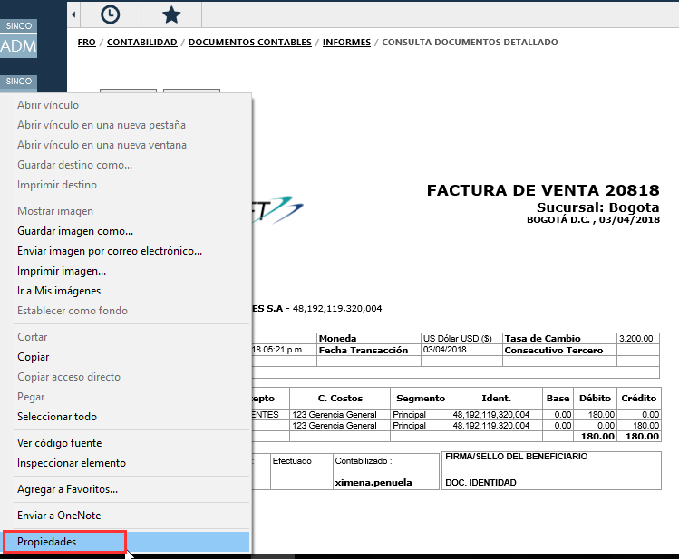{width="4.203163823272091in"
height="3.4626859142607174in"}

En la sección ***Dirección (URL)*** en la parte final se podrá consultar
el número (Doc=ID) del documento.

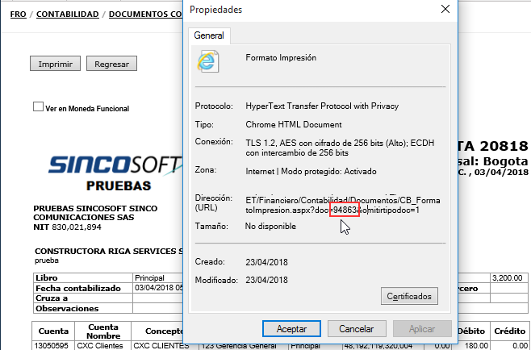{width="4.320895669291339in"
height="2.8497954943132107in"}

*Proceso de Sincronización*
===========================

Para realizar el proceso de sincronización deberá ingresar a la opción
*Financiero \> Facturación \> Facturación Electrónica \>
Configuraciones*, ficha ***Sincronización***.

{width="6.131944444444445in"
height="1.226388888888889in"}

Esta cuenta con dos pestañas, en la primera podrá sincronizar la
información de *SINCOERP* al proceso de Facturación Electrónica y en la
segunda pestaña podrá enviar o trasladar los documentos sincronizados al
proveedor tecnológico.

{width="6.131944444444445in"
height="2.915277777777778in"}

Al realizar esta sincronización se trasladará la información de
facturas, notas crédito y documentos de reversión del módulo CBR a la
base de datos de Facturación Electrónica, la cual procesará la
información y la homologará para ser entregada al proveedor tecnológico.

Para realizar la sincronización:

1.  Verifique el NIT emisor, este debe ser el de la compañía.

2.  Dentro de la opción Id de los documentos ingrese el [[código
    interno]{.underline}](#consulta-de-código-interno-del-documento) del
    documento (Factura, Nota crédito, reversión) previamente
    contabilizado que se requiera sincronizar.

3.  Si se requieren sincronizar varios documentos, los códigos internos
    deben ir separados por comas y sin espacios.

4.  Al ingresar los id de los documentos, en la parte inferior en la
    sección **xmlDocumentos:** podrá visualizar los registros que el
    proceso sincronizará.

***Ejemplo:*** Se ingresa en el campo Id de los documentos el código
1020, al dar clic fuera del campo se mostrarán los datos en la parte
inferior y automáticamente se activará el botón para ejecutar el proceso
de sincronización.

{width="6.127777777777778in"
height="2.7916666666666665in"}

El sistema permite realizar el traslado de los documentos contabilizados
que se encuentran pendientes por sincronizar sin necesidad de conocer el
código de los documentos, esta acción se puede realizar utilizando la
palabra "TODOS".

Dentro del campo ***Id de los documentos*** se debe digitar exactamente
la palabra ***TODOS*** en mayúscula. Si el ingreso es correcto, en la
sección **xmlDocumentos** no se mostrarán datos.

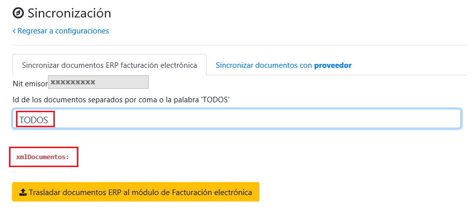{width="6.127777777777778in"
height="2.7756944444444445in"}

Si el texto se digita erróneamente, el campo **xmlDocumentos** mostrará
información.

***Ejemplo:*** Si se registra todos en minúscula, el campo
**xmlDocumentos** mostrará el dato a trasladar, lo cual generará error.

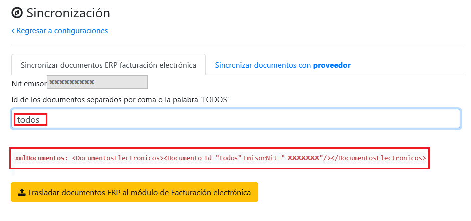{width="6.1375in"
height="2.8751312335958006in"}

Entre comillas se muestra la palabra Id=\"**TODOS** \" con el espacio,
lo cual generará error.

{width="6.127777777777778in"
height="2.879861111111111in"}

5.  Para terminar con la sincronización de los documentos se debe
    seleccionar el botón.

{width="3.2271784776902885in"
height="0.3125in"}

El proceso mostrará el resultado de la sincronización, indicando el
detalle de los documentos sincronizados.

{width="6.136111111111111in"
height="2.4159722222222224in"}

***Estado:*** El estado mostrará el resultado total del proceso, si se
generó correctamente (**OK**) o con errores (**ERROR**) en cualquiera de
las tres validaciones.

***Descripción:*** Este campo indica por separado, el resultado de las
tres validaciones que realiza el proceso de sincronización.

***Fecha:*** Momento en el que se realizó la sincronización.

***No:*** Orden de procesamiento de los documentos.

***Estado:*** Resultado de la sincronización de cada documento (OK o
Error).

***Nit emisor:*** Número de identificación de la compañía.

***Base datos:*** Nombre de la base de datos de donde se está tomando la
información.

***Tipo documento:*** Nombre del tipo de documento que se está
sincronizando.

***Código tipo Documento:*** Código asignado al tipo de documento en la
aplicación.

***Número documento:*** Consecutivo del documento.

***Id documento:*** [[Código interno del
documento.]{.underline}](#consulta-de-código-interno-del-documento)

***Descripción:*** Especificación del resultado de la sincronización.

*Validaciones en el proceso de sincronización*
----------------------------------------------

En la sincronización de documentos se realizan tres tipos de
validaciones, generales, de facturas y notas crédito.

De manera secuencial se aplican las validaciones sobre cada documento
que no ha sido trasmitido, al cumplir las validaciones los documentos
pueden ser consultados en los reportes de la opción ***Facturación
Electrónica***. Debido a que este proceso es jerárquico, si la
validación del proceso anterior falla la sincronización se detiene y
ningún documento se sincroniza.

***Ejemplo 1:** Si las validaciones son exitosas*.

{width="6.136111111111111in"
height="2.752083333333333in"}

***Ejemplo 2:** Si las validaciones Generales fallan, toda la
sincronización se detiene.*

***Ejemplo 3:** Si las validaciones de Notas crédito fallan, se
sincronizan solamente las facturas. *

**Ejemplo 4:** *Si no se encuentran facturas para sincronizar, se
transmiten las Notas crédito.*

Algunas validaciones que el sistema realiza a los documentos son:

-   La Factura o Nota crédito debe estar correctamente contabilizada.

-   La fecha de la factura debe ser igual o mayor a la de puesta en
    marcha.

-   La factura debe contar como mínimo con una cuenta de ingreso y un
    total a pagar activo, en el maestro de cuentas contables del sub
    módulo Facturación Electrónica.

-   Para el caso de las facturas de mandato del módulo CBR, los datos
    del mandante deben estar completos.

-   Para la transmisión de notas crédito, se debe haber sincronizado
    previamente la factura relacionada.

-   No se deben presentar saltos en los consecutivos de las facturas.

*Errores en el proceso de sincronización*
-----------------------------------------

A continuación, se listan los posibles errores que se pueden presentar
en la sincronización y su solución.

  **Tipo Error**   **Resultado**   **Mensaje de resultado**                                                                                                                                                                                                                                                          **Solución**                                                                                                                                                                                                                                                                                                                                                                                                                                                                                                  **Datos específicos**
  ---------------- --------------- --------------------------------------------------------------------------------------------------------------------------------------------------------------------------------------------------------------------------------------------------------------------------------- ------------------------------------------------------------------------------------------------------------------------------------------------------------------------------------------------------------------------------------------------------------------------------------------------------------------------------------------------------------------------------------------------------------------------------------------------------------------------------------------------------------- ------------------------
  Principal        OK              La sincronización de documentos electrónicos se ejecutó correctamente. Facturas de venta sincronizadas.                                                                                                                                                                                                                                                                                                                                                                                                                                                                                                                                                                                                                                                                                         
                   OK              La sincronización de documentos electrónicos se ejecutó correctamente. No existen documentos factura venta para procesar.                                                                                                                                                                                                                                                                                                                                                                                                                                                                                                                                                                                                                                                                       
                   OK              La sincronización de documentos electrónicos se ejecutó correctamente. Notas crédito sincronizadas.                                                                                                                                                                                                                                                                                                                                                                                                                                                                                                                                                                                                                                                                                             
                   OK              La sincronización de documentos electrónicos se ejecutó correctamente. No existen documentos nota crédito para procesar.                                                                                                                                                                                                                                                                                                                                                                                                                                                                                                                                                                                                                                                                        
                   ERROR           Se detectaron inconsistencias al ejecutar la sincronización: Por favor configure las empresas para extraer las facturas en la tabla FAE\_SYS.empresa.                                                                                                                             Mediante un Help Desk se debe solicitar la configuración de la empresa.                                                                                                                                                                                                                                                                                                                                                                                                                                       
                   ERROR           Se detectaron inconsistencias al ejecutar la sincronización: No está configurada la variable \"FECHA\_INICIAL\_DOCS\", con la fecha de inicial para buscar los documentos contables.                                                                                              Mediante un Help Desk se debe solicitar la configuración de la fecha inicial del proceso de facturación electrónica.                                                                                                                                                                                                                                                                                                                                                                                          
                   ERROR           Se detectaron inconsistencias al ejecutar la sincronización: No está configurada la variable \"CALCULAR\_VALOR\_TOTAL\_AGRUPACION\", vacío para que el total se calcule con la Cuenta por cobrar, si se requiere agrupar la combinación básica es \"IVA, INGRESO, DEVOLUCION\".   Mediante un Help Desk se debe solicitar la configuración de esta variable a SINCOSOFT.                                                                                                                                                                                                                                                                                                                                                                                                                        
                   ERROR           Se detectaron inconsistencias al ejecutar la sincronización: No está configurada la variable \"AGRUPA\_CONCEPTOS\_FACTURACION\_INGRESOS\", con los valores \"1\" o \"0\".                                                                                                         Mediante un Help Desk se debe solicitar la configuración de esta variable a SINCOSOFT.                                                                                                                                                                                                                                                                                                                                                                                                                        
                   ERROR           Se detectaron inconsistencias al ejecutar la sincronización: No existe ningún tipo de documento factura configurado.                                                                                                                                                              Mediante un Help Desk se debe solicitar la configuración de los tipos de documentos a SINCOSOFT.                                                                                                                                                                                                                                                                                                                                                                                                              
                   ERROR           Se detectaron inconsistencias al ejecutar la sincronización: No existe ningún tipo de documento nota crédito configurado.                                                                                                                                                         Mediante un Help Desk se debe solicitar la configuración de los documentos a SINCOSOFT.                                                                                                                                                                                                                                                                                                                                                                                                                       
                   ERROR           Se detectaron inconsistencias al ejecutar la sincronización: No existe ningún concepto de facturación configurado.                                                                                                                                                                Mediante un Help Desk se debe solicitar la configuración de los conceptos a SINCOSOFT.                                                                                                                                                                                                                                                                                                                                                                                                                        
                   ERROR           Se detectaron inconsistencias al ejecutar la sincronización: Existen cuentas contables pendientes por definir en la configuración.                                                                                                                                                Verificar en la configuración contable de Facturación electrónica opción FRO \> Facturación \> Facturación electrónica \> Configuraciones \> Cuentas contables, que las cuentas contables que contiene el documento a sincronizar tengan su respectiva asignación en la opción tipo y esta se encuentre activa, de lo contrario se debe realizar la respectiva asignación. Si alguna de las cuentas contables no se encuentra dentro de esta opción se debe remitir el caso mediante Help Desk a SINCOSOFT.   
                   ERROR           Se detectaron inconsistencias al ejecutar la sincronización: No existe ningún tipo de documento de identificación configurado.                                                                                                                                                    Mediante un Help Desk se debe solicitar la configuración de los tipos de documentos a SINCOSOFT.                                                                                                                                                                                                                                                                                                                                                                                                              
                   ERROR           Se detectaron inconsistencias al ejecutar la sincronización: Facturas de venta con saltos en los consecutivos.                                                                                                                                                                    Se debe verificar si las facturas antecesoras se encuentran trasladadas.                                                                                                                                                                                                                                                                                                                                                                                                                                      
  Detalle          OK              Factura sincronizada correctamente.                                                                                                                                                                                                                                                                                                                                                                                                                                                                                                                                                                                                                                                                                                                                                             
                   OK              Nota crédito sincronizada correctamente.                                                                                                                                                                                                                                                                                                                                                                                                                                                                                                                                                                                                                                                                                                                                                        
                   OK              Consecutivos verificado.                                                                                                                                                                                                                                                                                                                                                                                                                                                                                                                                                                                                                                                                                                                                                                        
                   OK              NO INSERTA FACTURAS EN TABLAS REALES, EJECUCIÓN DEL PROCESO EN MODO DEPURACIÓN.                                                                                                                                                                                                                                                                                                                                                                                                                                                                                                                                                                                                                                                                                                                 
                   OK              NO INSERTARON NOTAS CRÉDITO EN TABLAS REALES, EJECUCIÓN DEL PROCESO EN MODO DEPURACIÓN.                                                                                                                                                                                                                                                                                                                                                                                                                                                                                                                                                                                                                                                                                                         
                   ERROR           El consecutivo de la factura anterior no está registrado.                                                                                                                                                                                                                         Verificar si las facturas anteriores se encuentran trasladadas al proceso de facturación electrónica.                                                                                                                                                                                                                                                                                                                                                                                                         
                   ERROR           No están configurados correctamente los datos principales de la factura.                                                                                                                                                                                                          Se debe validar que estén completos los datos requeridos para transmitir los documentos.                                                                                                                                                                                                                                                                                                                                                                                                                      Datos de la factura.
                   ERROR           No están configurados correctamente los datos del emisor de la factura.                                                                                                                                                                                                           Validar en la opción Registro de terceros la información de la compañía. A excepción de los datos dirección y teléfono, estos son tomados directamente de la información de la sucursal en la cual se generó la factura.                                                                                                                                                                                                                                                                                      Datos del Emisor.
                   ERROR           Los datos del cliente de la factura están incompletos.                                                                                                                                                                                                                            Validar la información del cliente en la opción Registro de terceros.                                                                                                                                                                                                                                                                                                                                                                                                                                         Datos del adquiriente.
                   ERROR           Los datos de los conceptos de facturación ingresados están incompletos.                                                                                                                                                                                                           Mediante un Help Desk se debe solicitar la configuración a SINCOSOFT.                                                                                                                                                                                                                                                                                                                                                                                                                                         
                   ERROR           Los datos de los conceptos de nota crédito no están correctamente configurados.                                                                                                                                                                                                   Verificar en la opción configuración de cuentas contables de Facturación Electrónica las cuentas contables registradas en la factura.                                                                                                                                                                                                                                                                                                                                                                         
                   ERROR           No están configurados correctamente los datos principales de la nota crédito.                                                                                                                                                                                                     Mediante un Help Desk se debe solicitar la configuración a SINCOSOFT.                                                                                                                                                                                                                                                                                                                                                                                                                                         
                   ERROR           No están configurados correctamente los datos del emisor de la nota crédito.                                                                                                                                                                                                      Validar en la opción Registro de terceros la información de la compañía.                                                                                                                                                                                                                                                                                                                                                                                                                                      Datos del Emisor.
                   ERROR           Los datos del cliente de la nota crédito están incompletos.                                                                                                                                                                                                                       Validar la información del cliente en la opción Registro de terceros.                                                                                                                                                                                                                                                                                                                                                                                                                                         Datos del adquiriente.
                   ERROR           Los datos de los conceptos de nota crédito ingresos están incompletos.                                                                                                                                                                                                            Verificar en la opción configuración de cuentas contables de Facturación Electrónica las cuentas contables registradas en la factura.                                                                                                                                                                                                                                                                                                                                                                         

{width="6.1375in"
height="1.6222287839020122in"}

> {width="6.1375in"
> height="1.8006200787401574in"}

  **Datos de la factura**   Fecha de la factura
  ------------------------- -------------------------------------
                            Número de resolución de facturación
                            Consecutivo inicial
                            Consecutivo final
                            Fecha inicial de resolución
                            Fecha final de la resolución

*Consulta de documentos*
========================

Desde la opción *FRO \> Facturación \> Facturación Electrónica \>
Reporte de documentos,* en la ficha ***Facturas***, podrá visualizar las
facturas que han sido sincronizadas y el estado en el que se encuentra
la transmisión de estas al proveedor tecnológico.

Al ingresar a la opción encontrará seis filtros que facilitarán la
consulta de datos.

***Cantidad de registros:*** Este filtro hace referencia a la cantidad
de documentos a consultar.

{width="2.1354166666666665in"
height="0.8645833333333334in"}

***\*Fecha inicial y Fecha final:*** En este filtro deberá seleccionar
un rango de fechas, teniendo en cuenta que el sistema solamente
consultará los documentos creados en ese periodo de tiempo. \****Estos
campos son obligatorios para realizar la consulta del informe.***

{width="4.020833333333333in"
height="0.9895833333333334in"}

***Origen de factura:*** Con este filtro podrá consultar documentos
desde un módulo determinado.

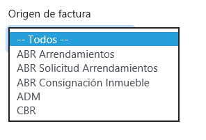{width="3.0833333333333335in"
height="2.09375in"}

***Tipo documento:*** Con este filtro podrá consultar documentos con un
tipo de documento en particular.

{width="2.2604166666666665in"
height="1.3020833333333333in"}

***Numero documento:*** Aquí podrá digitar el consecutivo para consultar
un documento en específico.

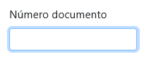{width="2.3048611111111112in"
height="0.9805555555555555in"}

Al seleccionar un rango de fechas, se habilitará el botón consultar, al
hacer clic sobre este el sistema dibujará un informe con los resultados
de su consulta.

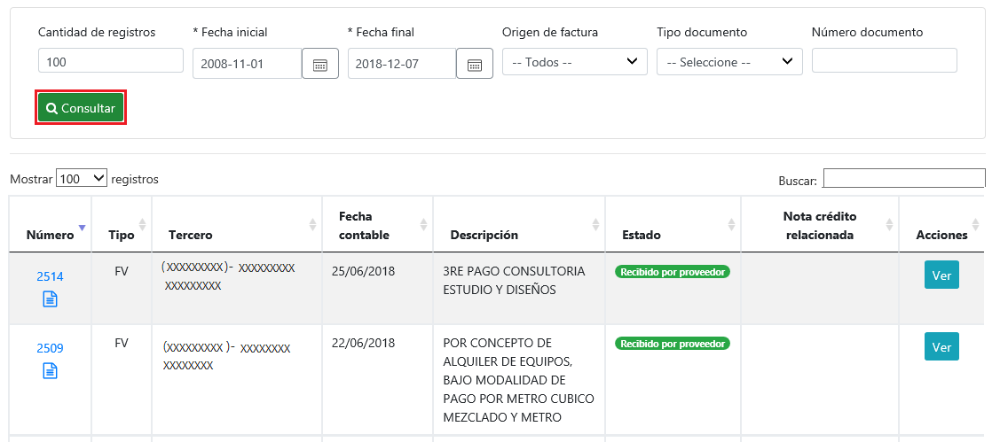{width="6.129861111111111in"
height="2.714583333333333in"}

Este informe contiene ocho columnas en las cuales podrá visualizar la
información básica de los documentos como:

{width="0.19631999125109362in"
height="0.20683180227471565in"}***Número:*** Esta columna cuenta con dos
enlaces, el primero es el consecutivo del documento, al hacer clic sobre
este se abrirá una nueva pestaña donde podrá visualizar el PDF de la
factura generado por SINCO, el segundo icono le permitirá la consulta
del documento contable del mismo.

***Tipo:*** Hace referencia al tipo de documento con el cual se generó
la factura.

***Tercero:*** Adquiriente o tercero al que se le genero el documento.

***Fecha contable:*** Fecha del documento.

***Descripción:*** Descripción registrada al momento de generar el
documento.

***Estado:*** Estos indicarán en que proceso se encuentra el envió del
documento al proveedor tecnológico.

***Nota crédito relacionada:*** Si la factura cuenta con una nota
crédito se mostrará su consecutivo.

***Acciones:*** Esta columna cuenta con un botón, el cual al dar clic
sobre él, se abrirá un modal donde podrá visualizar tres pestañas con el
detalle del documento.

***Pestaña 1: General***

En esta pestaña se mostrará información básica del documento.

{width="3.351881014873141in"
height="3.447853237095363in"}

***Descripción general:*** Hace referencia al texto digitado en el campo
descripción o servicio, al momento de generar el documento.

***Fecha factura:*** Fecha del documento seleccionado.

***CUFE (Código único de facturación electrónica):*** Este código es el
número de identificación de la factura y lo genera el proveedor
tecnológico al momento de recibir la información del documento.*\*Este
dato es traído desde la plataforma del proveedor.*

***Número factura:*** Consecutivo del documento.

***Nit emisor:*** Número de identificación de la empresa que generó el
documento.

***Fecha registro:*** Fecha en la cual se sincronizó el documento al
proceso de Facturación Electrónica.

***Estado notificación correo:*** Indica si la notificación del
documento fue enviada al adquiriente exitosamente. *\*Este dato es
traído desde la plataforma del proveedor.*

***Estado entrega:*** Indica si el documento ya fue aceptada o rechazada
por el cliente. *\*Este dato es traído desde la plataforma del
proveedor.*

***Comunicación DIAN:*** Indica si el documento fue aceptado por la DIAN
o presenta errores. *\*Este dato es traído desde la plataforma del
proveedor.*

***Ver Json Proveedor:*** Al dar clic sobre el botón se mostrará la
información que se enviará al proveedor especificando la etiqueta en la
cual será trasmitida.

***Ver Json Sinco:*** Al dar clic sobre el botón podrá visualizar la
misma información pero de una manera más clara, para que el usuario
pueda validar la información del documento, antes de transmitirlo.

***Volver a trasladar desde el ERP:*** [[Re sincronizar
documentos]{.underline}](#re-sincronizar-documentos)

***Pestaña 2: Seguimiento interno ***

En esta pestaña se muestran los errores que puede presentar el documento
en el envío al proveedor*.*

{width="4.8111843832021in"
height="2.5833333333333335in"}

***Pestaña 3: Proveedor tecnológico ***

En esta pestaña podrá visualizar la auditoria de los cambios presentados
en los estados del documento, después de realizar el envío al proveedor.

{width="5.153373797025372in"
height="2.3330468066491687in"}

*Generación de archivo plano*
=============================

Desde la ruta *FRO \> Facturación \> Facturación Electrónica \> Reporte
de documentos*, en la ficha ***Informe estructura estándar facturas***,
podrá realizar la consulta y exportación del consolidado de las facturas
contabilizadas, teniendo en cuenta los filtros que realice. A
continuación, encontrará los pasos para generar el informe.

La opción contará con cinco filtros que facilitará la consulta de los
datos.

{width="5.688311461067366in"
height="0.8665080927384077in"}

***Fecha inicial y Fecha final***: En este filtro deberá seleccionar un
rango de fechas, teniendo en cuenta que el sistema solamente consultará
los documentos creados en ese periodo de tiempo. **\**Estos campos son
obligatorios para realizar la consulta del informe.***

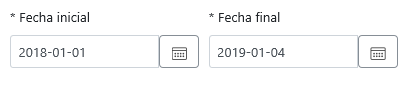{width="4.292361111111111in"
height="0.8958333333333334in"}

***Origen de factura:*** Con este filtro podrá consultar los documentos
generados desde un módulo determinado.

{width="3.0833333333333335in"
height="2.09375in"}

***Tipo documento:*** Con este podrá consultar los documentos generados
con un tipo de documento en particular.

{width="2.2604166666666665in"
height="1.3020833333333333in"}

***Numero documento:*** Aquí podrá digitar el consecutivo y consultar un
documento en específico.

{width="2.3048611111111112in"
height="0.9805555555555555in"}

Al seleccionar un rango de fechas, se habilitará el botón consultar, al
hacer clic sobre este el sistema dibujará un informe con los resultados
de su consulta.

{width="6.083333333333333in"
height="2.8181813210848645in"}

El informe contiene diez columnas donde podrá identificar la información
básica del documento como:

***Número:*** Consecutivo del documento.

***Tipo:*** Hace referencia al tipo de documento con el cual se generó
la factura.

***Fecha contable:*** Fecha del documento.

***Descripción:*** Descripción registrada al momento de generar el
documento.

***Origen de factura:*** Indica desde que modulo fue generado el
documento.

***Tercero:*** Adquiriente o tercero al que se le generó el documento.

***Nota crédito relacionado:*** Si la factura cuenta con una nota
crédito se mostrará su consecutivo.

***Moneda:*** Indica la moneda con el cual fue generado el documento .

***Valor total:*** Valor total de la factura.

***Ver factura:*** Esta columna cuenta con un enlace, al dar clic sobre
este se abrirá una nueva pestaña donde podrá visualizar el PDF de la
factura generado por SINCO.

Para exportar el archivo seleccione el botón descargar, podrá consultar
el consolidado en la carpeta de descargas del equipo donde esté
realizando la acción.

{width="6.122222222222222in"
height="2.8159514435695536in"}

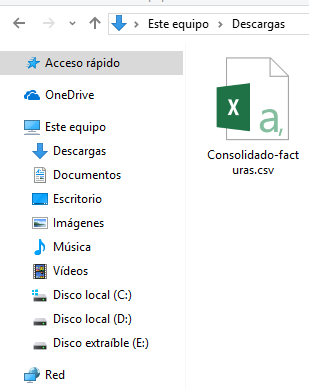{width="2.2in"
height="1.325404636920385in"}

Para visualizar el consolidado de manera clara y organizada, abra el
archivo *Macro archivo plano -- FE*, relacionado por la consultora del
proceso, haga clic sobre el botón *Importar archivo .CSV facturación
electrónica* y seleccione el consolidado.

{width="5.06875in"
height="2.653254593175853in"}

Se agregará automáticamente una nueva hoja con 88 columnas que incluyen
toda la información de los documentos.

{width="5.8901060804899386in"
height="2.2208595800524935in"}

*Re sincronizar documentos*
---------------------------

Esta funcionalidad fue creada con el fin de que el usuario pueda
modificar la información de los documentos, antes de realizar el envío a
la plataforma del proveedor tecnológico, en caso de haberlo realizado se
deberá crear una nota crédito por el valor total de la factura por el
mismo módulo por donde generó la misma.

En la ruta *FRO \> Facturación \> FACTURACIÓN ELECTRÓNICA \> Reporte de
documentos*, ingrese a la ficha ***Facturas.*** A continuación, consulte
un documento que se encuentre en estado pendiente por enviar o en error
y en la columna *Acciones* haga clic sobre el botón *Ver*.

{width="3.395323709536308in"
height="1.1168832020997375in"}

Se abrirá el modal con la información básica del documento, en la parte
inferior encontrará un botón de color rojo con la descripción ***Volver
a trasladar desde el ERP***, este le permitirá re sincronizar o volver a
copiar la información del documento al proceso de Facturación
Electrónica, con la condición de que el estado del documento sea
distinto a *Recibido por provee*dor.

{width="3.9102416885389326in"
height="4.024000437445319in"}

*Traslado de documentos a proveedor tecnológico*
================================================

Después de realizar la validación de los documentos con el archivo
plano, se deben trasladar la información al proveedor tecnológico.
Ingrese a la opción *FRO \> Facturación \> FACTURACIÓN ELECTRÓNICA \>
CONFIGURACIONES* en la ficha de ***Sincronización**,* diríjase a la
pestaña *Sincronizar documentos con **proveedor ***y haga clic sobre el
botón *Ejecutar sincronización con el proveedor tecnológico.*

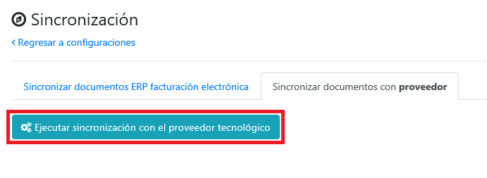{width="6.131944444444445in"
height="2.245138888888889in"}

Al realizar esta acción el sistema hará el envío de todos los documentos
que se encuentren en estado *Pendiente por enviar* y mostrará un modal
con el estado del traslado.

{width="5.886792432195976in"
height="2.1188451443569556in"}

Al ingresar al reporte de documentos en la ficha ***Facturas**,* podrá
ver que el estado de los documentos cambio a *Recibido por proveedor.*

{width="6.131944444444445in"
height="1.0284722222222222in"}

El modal con el detalle del documento también cambiará. Ahora cada vez
que haga clic sobre el botón, el sistema realizará una consulta en la
plataforma del proveedor, para que pueda visualizar los estados de
envío, tanto de la notificación enviada al adquiriente, como la
aceptación por parte de la DIAN.

{width="5.541666666666667in"
height="5.974465223097113in"}

{width="5.698113517060367in"
height="5.277451881014873in"}

***NOTA:** SincoERP no realiza la generación de representaciones
graficas ni el envío de notificaciones de documentos, en caso de
presentar inconsistencias en estos comuníquese con su proveedor
tecnológico.*

*Errores en el traslado de la información*
------------------------------------------

A continuación relacionamos los posibles errores que se pueden presentar
al momento de realizar el traslado de la información y su
interpretación.

  Error                                                                                                                                                                          Interpretación
  ------------------------------------------------------------------------------------------------------------------------------------------------------------------------------ -----------------------------------------------------------------------------------------------------------------------------------------------------------------------------
  SalesInvoice.SellerContracts\[0\].ContractCode                                                                                                                                 El número de contrato de mandato no está configurado y este es requerido por el proveedor tecnológico.
  SerieNumberGreaterThanSerieEndValue                                                                                                                                            El consecutivo de la factura es mayor al consecutivo final registrado en la serie de en la plataforma del proveedor tecnológico.
  \"SalesInvoice.CustomerParty.Email\\\",\\\"Code\\\":\\\"Invalid\\\"                                                                                                            El correo del adquiriente es inválido.
  CreditNote.SerieExternalKey\\\",\\\"Code\\\":\\\"Required                                                                                                                      No se encuentra configurada la clave externa para el tipo de documento que se está tratando de trasladar.
  System.Exception: Error La factura con Id 'XX' no tiene detalles                                                                                                               La cuenta de ingreso de la factura se encuentra deshabilitada.
  Actualmente hay facturas en estado error, por lo cual no se permite realizar la sincronización al proveedor. Re traslade y verifique las facturas en estado error.             Debe ingresar a la opción reporte de documentos ficha Facturas y consultar el error que indica el sistema en la factura con estado *Error enviando al proveedor*.
  Actualmente hay notas crédito en estado error, por lo cual no se permite realizar la sincronización al proveedor. Re traslade y verifique las notas crédito en estado error.   Debe ingresar a la opción reporte de documentos ficha Notas crédito y consultar el error que indica el sistema en la nota crédito con estado *Error enviando al proveedor.*
                                                                                                                                                                                 

*Consulta de representación grafica*
------------------------------------

Después de realizar el traslado de los documentos, podrá realizar la
consulta de la representación gráfica generada por el proveedor
tecnológico, ingresando a la opción *FRO \> Facturación \> FACTURACIÓN
ELECTRÓNICA \> Reporte de documentos* ficha ***Facturas**,* consulte las
facturas y en la columna *Acciones* haga clic sobre el botón *Ver*.

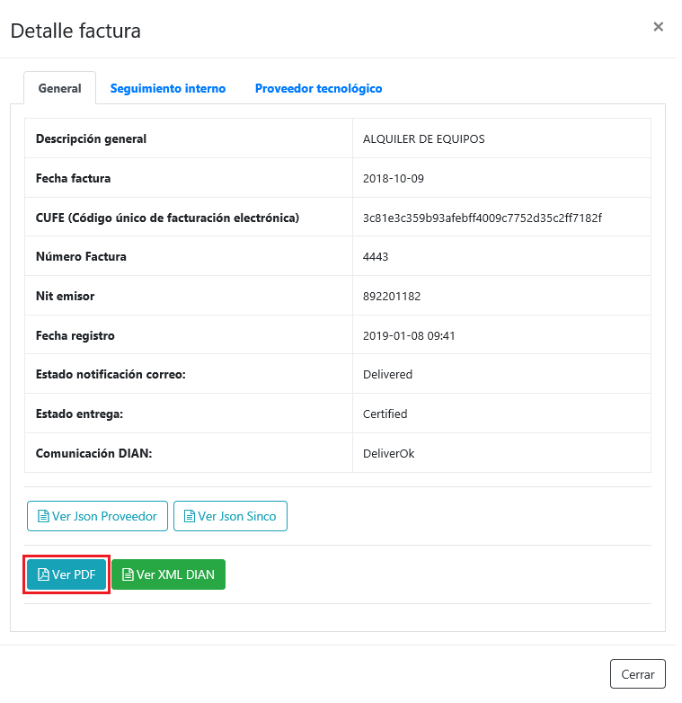{width="5.557200349956256in"
height="5.729166666666667in"}

En la parte inferior del modal con la información del documento, podrá
encontrar un botón el cual al hace clic sobre él, se abrirá una nueva
pestaña donde automáticamente se descargara el PDF del documento.

***NOTA:** SincoERP no realiza ningún tipo de almacenamiento de este
documento, solamente consulta los archivos directamente en la plataforma
del proveedor para su visualización.*

*Consulta de archivo XML*
-------------------------

Después de realizar el envío de los documentos, podrá realizar la
consulta del archivo XML generado por el proveedor tecnológico,
ingresando a la opción *FRO \> Facturación \> FACTURACIÓN ELECTRÓNICA \>
Reporte de documentos* ficha ***Facturas**,* consulte las facturas y en
la columna *Acciones* haga clic sobre el botón *Ver*.

{width="4.947916666666667in"
height="5.3105489938757655in"}

En la parte inferior del modal con la información del documento, podrá
encontrar un botón el cual al hace clic sobre él, se abrirá una nueva
pestaña donde automáticamente se descargará el XML del documento.

***NOTA:** SincoERP no realiza ningún tipo de almacenamiento de este
documento, solamente consulta los archivos directamente en la plataforma
del proveedor para su visualización.*

*Recomendaciones*
=================

-   Si requiere re sincronizar un documento valide que el documento
    cuenta con todas los datos necesarios para la sincronización, en
    caso de no ser así el sistema eliminará el registro de Facturación
    Electrónica, debido a que no cumple con las condiciones necesarias
    para realizar el proceso.

-   No genere facturas con fecha anterior a la última trasladada
    exitosamente al proveedor tecnológico, puesto que el proveedor
    rechazará estas facturas y se presentará un bloque ya que el sistema
    no permite realizar envíos con registros en estado error.

*Preguntas frecuentes*
======================

*La información contenida en este documento es confidencial y propiedad
de SINCOSOFT S.A.S. *

*SINCOSOFT S.A.S. entrega este manual bajo el entendimiento de que será
manejado en forma estrictamente confidencial y no será divulgado,
duplicado o usado, completa o parcialmente, con ningún otro propósito
diferente al de dar a conocer el manejo correcto y óptimo de las
herramientas que están integradas en el software SINCO ERP del módulo
SINCO SGD, sin el previo consentimiento escrito por parte de SINCOSOFT
S.A.S.*
